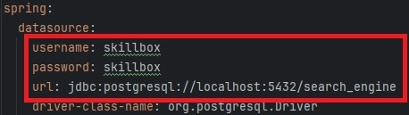
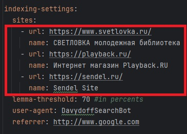
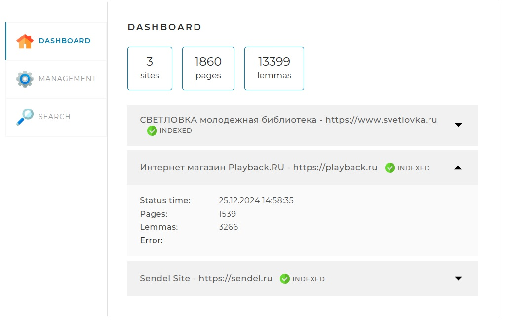
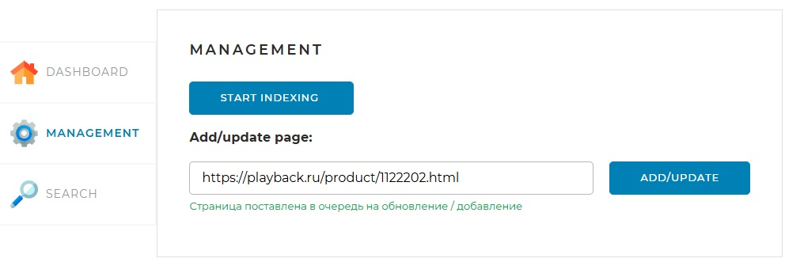
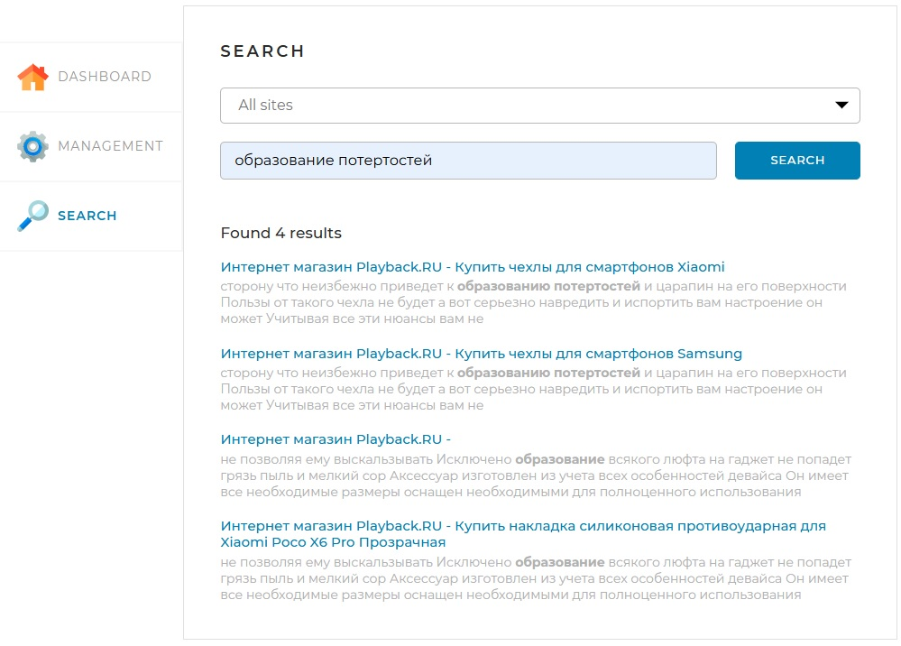

# Поисковый движок DavydoffSearchEngine

Является итоговым проектом курса JAVA-разработчика на skillbox.ru.
Проект должен показать насколько обучаемый усвоил все знания курса и научился ими пользоваться.
Поисковый движок представляет собой Spring-приложение, работающее с локально установленной базой данных MySQL, имеющее простой веб-интерфейс и API, через который им можно управлять и получать результаты поисковой выдачи по запросу.

## Что делает поисковый движок
Поисковый движок обходит и индексирует все страницы сайтов, указанных в конфигурационном файле.
Далее по проиндексированным страницам можно осуществить поиск по русским словам или фразам.
Страницы, на которых встречаются леммы из поисковых слов, будут выданы в поисковой выдаче в порядке убывания их релевантности.
К каждой странице будет прикреплён небольшой наиболее подходящий текстовый кусок страницы (т.н. сниппет) с выделение жирным слов(лемм),
по которым производился поиск.

## Инструкция по запуску
1. У вас должна быть установлена СУБД PostgresSQL
   1. В ней должна быть создана БД `search_engine` (если нет, создайте вручную с помощью, например, `pgAdmin`)
   2. По умолчанию для подключения используется:
       1. порт подключения: 5432
       2. логин: skillbox
       3. пароль: skillbox
      
       Если вам необходимы изменить значения по умолчанию, то отредактируйте соответствующие значения в файле `application.yml`
      
       
   3. При 1-м запуске все необходимые таблицы со всеми ключами/индексами будут созданы автоматически средствами `liquibase`.
2. По умолчанию в конфигурационном файле указаны 3 сайта, по которым работает поисковый движок. Если хотите изменить эти сайты, то отредактируйте соответствующие значения в `application.yml`

   
3. После запуска приложения, в браузере заходите по адресу http://localhost:8080/ - там находится клиентский часть приложения, где работает пользователь.
Там находятся 3 основные части:
   1. `DASHBOARD` - тут доступна основная статистика по тому, сколько сайтов, страниц и лемм было проиндексировано
   2. `MANAGEMENT` - основная вкладка для запуска/остановки индексации сайтов
   3. `SEARCH` - основная вкладка для поиска по словам/фразам по ранее проиндексированным сайтам.
Примеры использования показаны ниже.

## Примеры использования
### Статистика - вкладка `DASHBOARD`
Показывает общую статистику по кол-ву сайтов, обработанных страниц и лемм. Также можно посмотреть более детальную статистику по конкретному сайту.

### Менеджмент - вкладка `MANAGEMENT`. Для запуска и остановки индексации всех сайтов. Также доступна индексация отдельных страниц
При нажатии на кнопку `START INDEXING` запустится механизм полного обхода и индексации всех страниц всех сайтов, указанных в конфигурационном файле (с удалением всей предыдущей информации в БД по этим сайтам)

Также возможно добавлять единичные страницы через кнопку `ADD/UPDATE`.

### Поиск по словам/фразам - вкладка `SEARCH`
Основная вкладка для осуществления поисковых запросов пользователем.
Можно выбирать поиск как по всем сайтам, так и по конкретному сайту из списка.

## Стэк используемых технологий и структура проекта
Поисковый движок сделан на фреймворке Spring Boot с использованием следующих библиотек:
1. Lombok - для уменьшения шаблонного кода
2. JSOUP - для парсинга и обработки html страниц 
3. Набор библиотек LUCENE MORPHOLOGY для превращения русских слов в леммы и для последующей работы с леммами
4. Hibernate - для работы с БД, автоматического создания нужных таблиц для работы приложения в БД и маппинга объектов БД в JAVA объекты и наоборот
5. Thymeleaf - шаблонизатор html страниц для создания корректного отображения на фронте для пользователя

### Структура проекта
Проект придерживается простой слоистой структуре (также известная как "луковичная"). Есть три слоя:

Presentation - контроллеры. Слой общается с пользователями, в нашем случае ожидает запросы по API. И отдает ответы.
Business - самый важный слой - бизнес логика, содержится в классах Сервисах. Этот слой ничего не знает о Presentation слое.
Data Access - слой отвечает за хранение данных, подключение к БД, реализацию запросов. Слой не знает о других слоях ничего.

Каждый слой занимается только своими задачами.

## Контакты автора-разработчика
Давыдов Виктор. 
Телефон: +7-905-527-68-39
Email: davictor@yandex.ru

